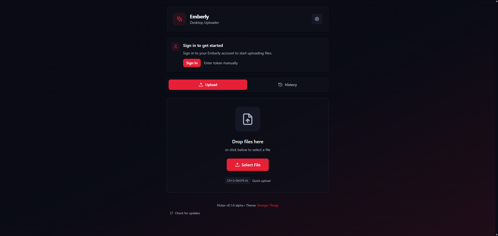

# Flicker

<div align="center">



**A powerful, ShareX like desktop uploader for [Emberly](https://embrly.ca)**

[](LICENSE)
[](https://embrly.ca/discord)
[](https://github.com/EmberlyOSS/Flicker)

</div>

---

## ✨ Features

- **🖼️ Screenshot Capture** - Capture fullscreen or region screenshots with global hotkeys
- **📤 Instant Upload** - Automatically upload screenshots and files to your Emberly account
- **📋 Auto-Copy URL** - URLs are automatically copied to your clipboard after upload
- **🔔 Desktop Notifications** - Get notified when uploads complete with preview popups
- **🎨 Theme Support** - Multiple themes including Cyberpunk Neon, Ocean Depths, and more
- **🔐 Secure Authentication** - Sign in with your Emberly account or use upload tokens
- **⌨️ Global Hotkeys** - Customizable keyboard shortcuts that work system-wide
- **🖥️ System Tray** - Runs in the background for quick access

## 📥 Installation

### Download

Download the latest release for your platform from the [Releases](https://github.com/EmberlyOSS/Flicker/releases) page.

| Platform | Download |
|----------|----------|
| Windows | `flicker_x.x.x_x64-setup.exe` |
| macOS | `flicker_x.x.x_x64.dmg` |
| Linux | `flicker_x.x.x_amd64.deb` |

### Build from Source

Prerequisites:
- [Node.js](https://nodejs.org/) 18+ or [Bun](https://bun.sh/)
- [Rust](https://rustup.rs/) (latest stable)
- [Tauri CLI](https://tauri.app/start/)

```bash
# Clone the repository
git clone https://github.com/EmberlyOSS/Flicker.git
cd Flicker/uploader

# Install dependencies
bun install
# or: npm install

## Run vite frontend only
bun run dev:vite
# or: npm run dev:vite

# Run in development mode (app and vite frontend)
bun run dev:tauri
# or: npm run dev:tauri

# Build for production
bun run tauri build
# or: npm run tauri build
```

## 🚀 Quick Start

1. **Download and install** the app for your platform
2. **Sign in** with your Emberly account (or enter your upload token manually)
3. **Configure hotkeys** in Settings → Hotkeys
4. **Start capturing!** Use your hotkey or click the camera button

## ⌨️ Default Hotkeys

| Action | Default Hotkey |
|--------|----------------|
| Fullscreen Screenshot | `Ctrl + Alt + PrintScreen` |
| Region Screenshot | `Ctrl + Shift + PrintScreen` |
| Upload from Clipboard | `Ctrl + Alt + U` |
| Open App | `Ctrl + Alt + E` |

*All hotkeys can be customized in Settings → Hotkeys*

## 🎨 Themes

Flicker comes with several built-in themes:

- **Default** - Clean, modern dark theme
- **Cyberpunk Neon** - Vibrant pink and cyan
- **Ocean Depths** - Calming blue tones
- **Forest Twilight** - Natural green hues
- **Sunset Glow** - Warm orange gradients
- **Midnight Purple** - Deep purple aesthetics
- **Arctic Frost** - Cool, crisp blues
- **Rose Gold** - Elegant pink tones

## 🔧 Configuration

### Upload Settings

- **Visibility** - Set default visibility (Public/Private)
- **Password Protection** - Add optional password to uploads
- **Auto-upload** - Automatically upload after capture
- **Notifications** - Toggle desktop notifications

### Account

Sign in with your Emberly account to:
- Sync your upload token automatically
- Access your upload history across devices
- Use your preferred upload domain

## 📁 File Locations

| Platform | Screenshots Directory |
|----------|----------------------|
| Windows | `Pictures\Flicker Screenshots` |
| macOS | `~/Pictures/Flicker Screenshots` |
| Linux | `~/Pictures/Flicker Screenshots` |

## 🤝 Contributing

We welcome contributions! Please see our [Contributing Guide](CONTRIBUTING.md) for details.

## 📜 Code of Conduct

Please read our [Code of Conduct](CODE_OF_CONDUCT.md) before participating in our community.

## 🐛 Bug Reports & Feature Requests

- **Bug Reports**: [Open an issue](https://github.com/EmberlyOSS/Flicker/issues/new?template=bug_report.md)
- **Feature Requests**: [Open an issue](https://github.com/EmberlyOSS/Flicker/issues/new?template=feature_request.md)
- **Questions**: Join our [Discord](https://embrly.ca/discord)

## 📄 License

This project is licensed under the MIT License - see the [LICENSE](LICENSE) file for details.

## 🔗 Links

- **Website**: [embrly.ca](https://embrly.ca)
- **Discord**: [embrly.ca/discord](https://embrly.ca/discord)
- **Documentation**: [embrly.ca/docs](https://embrly.ca/docs)
- **Status**: [embrly.ca/status](https://embrly.ca/status)

---

<div align="center">

Made with ❤️ by the [Emberly Team](https://embrly.ca)

</div>
