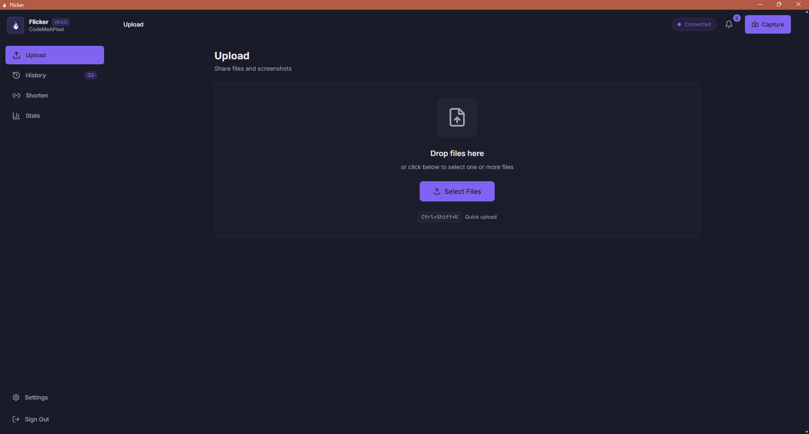

# Flicker

<div align="center">




[](https://embrly.ca/discord)
[](https://github.com/EmberlyOSS/Flicker)

</div>

---

## Features

- **Screenshot capture** — fullscreen or all-monitors capture via global hotkeys
- **Instant upload** — screenshots and files upload straight to your Emberly account
- **Clipboard integration** — upload the image currently on your clipboard, and get the result URL copied back automatically
- **Desktop notifications** — get notified when an upload completes
- **Upload history** — searchable, filterable, sortable history with previews and bulk actions
- **Theming** — a dark theme system with several built-in presets
- **Authentication** — sign in with your Emberly account or use an upload token
- **Global hotkeys** — customizable, system-wide keyboard shortcuts
- **System tray** — runs in the background for quick access

## Installation

### Download

Download the latest release for your platform from the [Releases](https://github.com/EmberlyOSS/Flicker/releases) page.

| Platform | Download |
|----------|----------|
| Windows | `flicker_x.x.x_x64-setup.exe` |
| macOS | `flicker_x.x.x_x64.dmg` |
| Linux | `flicker_x.x.x_amd64.deb` |

### Build from Source

Prerequisites:
- [Node.js](https://nodejs.org/) 18+ or [Bun](https://bun.sh/)
- [Rust](https://rustup.rs/) (latest stable)
- [Tauri CLI](https://tauri.app/start/)

```bash
# Clone the repository
git clone https://github.com/EmberlyOSS/Flicker.git
cd Flicker

# Install dependencies
bun install
# or: npm install

# Run the frontend only (vite dev server)
bun run dev
# or: npm run dev

# Run the full desktop app in development mode
bun run tauri:dev
# or: npm run tauri:dev

# Build for production
bun run tauri:build
# or: npm run tauri:build
```

### Distribution / Cross-Platform Builds

Tauri apps embed the OS's native webview and produce OS-native installers, so a
Windows machine cannot produce a macOS `.dmg` or a Linux AppImage/`.deb`/`.rpm` —
each platform must be built natively. `.github/workflows/release.yml` handles
this with a GitHub Actions matrix (`windows-latest`, `macos-latest` for both
Apple Silicon and Intel, `ubuntu-22.04`) that builds and drafts a GitHub Release
whenever a `flicker-v*` tag is pushed, or on demand via workflow dispatch.

Code signing and notarization (required for a smooth install experience on
Windows and macOS) and updater-artifact signing are not yet configured — the
workflow will still produce unsigned installers without them. See
[Tauri's distribution docs](https://v2.tauri.app/distribute/) for setting up
signing when ready.

## Quick Start

1. Download and install the app for your platform.
2. Sign in with your Emberly account, or enter an upload token manually.
3. Configure hotkeys in Settings → Hotkeys.
4. Capture with your hotkey, or use the Capture button in the header.

## Default Hotkeys

| Action | Default Hotkey |
|--------|----------------|
| Fullscreen Screenshot | `Ctrl + Shift + S` |
| All Monitors Screenshot | `Ctrl + Shift + A` |
| Upload from Clipboard | `Ctrl + Alt + U` |
| Region Screenshot | Not yet implemented |

All hotkeys can be customized in Settings → Hotkeys.

## Themes

Flicker includes a set of built-in dark color themes (Stranger Things, Emberly Classic, Dracula, Tokyo Night, Nord, Rose Pine, Catppuccin, Cyberpunk Neon, Vaporwave, Dark Matrix, Aurora Borealis, Sunset, Ocean Deep, and seasonal variants), selectable from Settings → Preferences.

## Configuration

### Upload Settings

- **Visibility** — default visibility for uploads (Public/Private)
- **Password protection** — optional password on uploads
- **Auto-upload** — upload automatically after capture
- **Post-upload action** — copy the URL, open it, or do nothing
- **Clipboard format** — copy as a direct URL, raw URL, Markdown, or HTML
- **Notifications** — toggle desktop notifications

### Account

Sign in with your Emberly account to:
- Sync your upload token automatically
- Access your upload history across devices
- Use your preferred upload domain

## File Locations

| Platform | Screenshots Directory |
|----------|----------------------|
| Windows | `Pictures\Flicker Screenshots` |
| macOS | `~/Pictures/Flicker Screenshots` |
| Linux | `~/Pictures/Flicker Screenshots` |

## Contributing

Contributions are welcome. See the [Contributing Guide](CONTRIBUTING.md) for details.

## Code of Conduct

Please read the [Code of Conduct](CODE_OF_CONDUCT.md) before participating in the community.

## Bug Reports & Feature Requests

- Bug reports: [open an issue](https://github.com/EmberlyOSS/Flicker/issues/new?template=bug_report.md)
- Feature requests: [open an issue](https://github.com/EmberlyOSS/Flicker/issues/new?template=feature_request.md)
- Beta testing feedback: [open an issue](https://github.com/EmberlyOSS/Flicker/issues/new?template=beta_feedback.md)
- Questions: [Discord](https://embrly.ca/discord)

## License

Licensed under the GNU Affero General Public License v3.0. See [LICENSE](LICENSE) for details.

## Links

- Website: [embrly.ca](https://embrly.ca)
- Discord: [embrly.ca/discord](https://embrly.ca/discord)
- Documentation: [embrly.ca/docs](https://embrly.ca/docs)
- Status: [embrly.ca/status](https://embrly.ca/status)

---

<div align="center">

Built by the [Emberly Team](https://embrly.ca)

</div>
